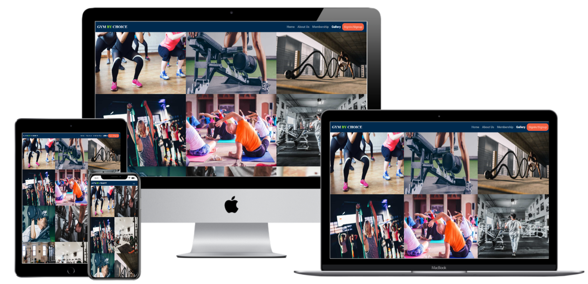
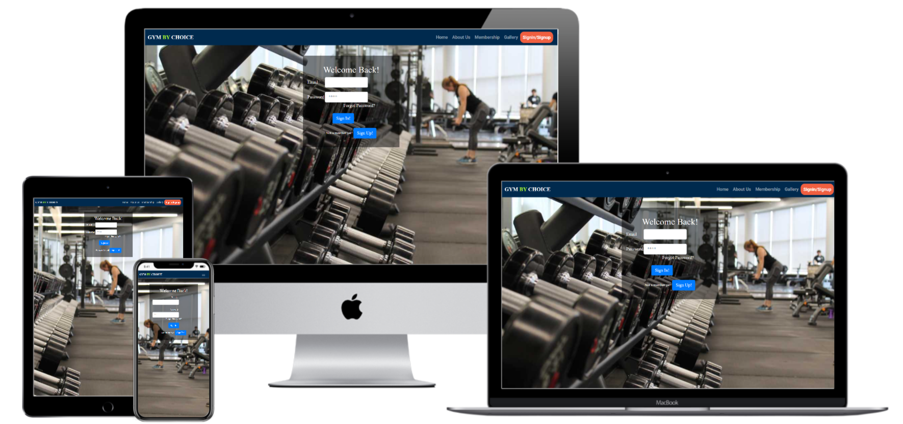

<h1 align="center">GYM BY CHOICE</h1>
<h1 align="center"></h1>

-[Live Website](https://rubysrivastava.github.io/ms1-gym/)

-[GitHub Repository](https://github.com/RubySrivastava/ms1-gym/)
 
 ## About

This project is made for the gym. It will be use by the users of gym who wants to know more about gym and for the business purpose of the owner who wants to grow his business.
For gym owners it will be utility to increase their presence over the internet which lead to increase their business by adding more customer.
It is designed to be responsive on all devices and easy to navigate for users and owner.

## Table of Contents

[User Experience (UX)](#UX)

[Features](#features)

[Technologies Used](#technologies)

[Testing](#testing)

[Deployment](#deployment)

[Known Bugs](#bugs)

[Credits](#credits)

## User Experience (UX)

### User Stories

This website will give an information to the users about the gym and their facilities.
It tells about how to being healthy with fitness activity.
It provides the campaign offer which attract users which gives benefit to both user (Good health) and gym owner (Profitability).

- #### Any user who check the website first time wants to access the site and know about gym. 
    1. I want to easily understand the purpose and the layout of the site without additional instructions needed.
    1. I want to intuitively navigate through the site to browse the content.
    1. I want to know about gym what services they offer.
    1. I want to know about training provided by gym.
    1. I want to know about price details to check the price for different training.
    1. I want to access gallery of gym to know more about inside picture of gym.
    1. I want to access external links. 

- #### The users who want to join the gym will check how far it is from their place and the contact details.
    1. I want to look the contact details easily without going to any tab on page.
    1. I want to look the address details easily without single click on screen.
    1. I want to check any offers which should be on landing page and I can find easily.

- #### The users who want to be member for the gym will look for signup button.
    1. I want to look the training which suits me.
    1. I want to check the price for my training.
    1. I want to look for signup button on landing page for becoming the member of gym.
   
- #### The users who are already a member will look for signin button to check their account and also check if there is any new offers.
    1. I want the site is responsive on all device as I usually use phone for doing all such type of stuff.
    1. I want to be able to use the website on any device so I can keep it handy.
    1. I want to use the navigation at all times and have it readily available so I can quickly navigate from one page to another.
    1. I can easily find the sign in button on home page.
     
### Design

- #### Colour 
    -  
    This website is design for gym which needs lots of motivation.
    The main color which is used for header and footer is dark blue which shows trust to stay with it.Which is perfectly fit for gym page.

    - 
      
      
    The alice blue and white color is used for background-color which shows intelligence and simplicity respectively.Because of this color the content looks simple and clear.
     
    - 
      
      
      

    These color used according to text context. As silver, gold and black show prosperity ,success and elegance ,it perfectly fit for membership section.
     
- #### Typography
    - The main font used is a Roboto with sans-serif as a fallback font.
    - The second font used is a Expo for brand name ,footer details and titles.

- #### Imagery
    - Images used for website describe overall information and details of gym.

- #### Mockups
    - Mockups were created using Adobe Xd.
    -[Desktop Wireframes](https://xd.adobe.com/view/6fd631a7-5485-457b-bd28-9d3cc5bb0178-3a85/)
    - Mockup made through original website 
    -[Wireframes](https://techsini.com/multi-mockup/index.php)
    
    
    
    
    
    

 
## Features

### Existing Features

#### Common Features Across All Pages

- [x] **Header** - allows user to easily navigate across all pages
    - The header itself is positioned to always be visible (positioned absolutely using Bootstrap 'fixed-top' class) at the top of the screen (mobile and desktop) which allows visitors to find it quickly.
    - The brand logo is positioned on the left and is visible on all pages.
    - Navigation is included in the header to let the user intuitively locate it.
    - Navigation links is more visible when hovered over. This lets the visitor know that it is clickable.
    - The navigation link, matching the page that the user is visiting, stays 'active' to let the user quickly establish which page is visiting.
    - Navigation links collapse in a home menu when viewed on mobile device.
    
- [x] **Accessibility**
    - All Pages have a description in case the image link breaks as well as helps screen readers.
    - The home menu has aria-label added to let users with screen readers know where the toggleable menu is.
    
- [x] **Buttons**
    - All buttons are styled in the way to provide consistency across the page. 

- [x] **Responsiveness**
    - All Pages are responsive on different viewport size.

- [x] **Footer**
    - Footer has been designed to be at the bottom of the page, regardless of the amount of content. This aids the overall user experience.
    - All content has been spaced out and aligned to the center.
    - Follow Us have social links and when hovered over, it changed the color.
    - Address have the address details with phone no. and E-mail address.
    - Opening Hours have the details of time and day.

### Specific to Pages
- [x] **Home**
    - This page has header, footer and a hero image in background. The header has navigation bar and footer has contact, schedule time and social links.The image brings the user's attention and inviting the user to explore the website.

- [x] **About Us**
    - The information of the gym to let the user know what the services gym provides.
    
- [x] **Membership**
    - This page uses cards and grid system to display the information of offers and membership of different training.

- [x] **Gallery**
    - This page display images of gym.

- [x] **Signin/Signup**
    - This page uses the form and allow you to signin/signup.

### Future Features
 
- [ ] Ongoing implementation of user feedback.
- [ ] Create a way for the user to rate the website without having to type up feedback.
- [ ] A page where people can review the comments.

## Technologies Used

### Languages Used

- [HTML5](https://en.wikipedia.org/wiki/HTML5)
- [CSS3](https://en.wikipedia.org/wiki/Cascading_Style_Sheets)

### Frameworks, Libraries and Programs Used

- [Bootstrap v4.5.0](https://getbootstrap.com/) - Used for the responsive layout as well as custom components such as header, footer, images, icons, grids, cards, and collapse element.
- [Font Awesome](https://fontawesome.com/) - Font Awesome is used to add social icons for socila links and icons for about us page.
- [Google Fonts](https://fonts.google.com/) - Google Fonts is used to import 'Expo'
- [Git](https://git-scm.com/) - Git is used to allow for tracking of any changes in the code and for the version control.
- [GitPod](https://www.gitpod.io/) - GitPod, connected to GitHub, hosted the coding space and allowed the project to be committed to the Github repository.
- [Github](https://github.com/) - GitHub is used to host the project files and publish the live website by using Git Pages.
- [Adobe Xd](https://www.adobe.com/ie/products/xd.html) - Adobe Xd is used to create mockups.

## Testing

 ### Functionality Testing
- #### Navigation bar
    - The navigation bar stays at the top of the page on all screen sizes.
    - When the nav links clicks it opens the relevent page in same window with same header footer.
- #### Footer
    - Footer is located at the bottom of the page regardless of the content amount.
    - When the social links are clicked, they open the relevant social media page in a new tab.
- #### All external links is tested to make sure they open up the correct pages in new tabs.
- #### All internal links is tested to make sure that all pages are correctly connected.
    
### CSS3 validator 

### HTML5 validator

### Usability Testing
- This website is shared on slack channel to get the feedback.This is also shared with friends to check on different device and accessbility.

### Compatibility Testing
- Browser Compatibility
    - Tested on Chrome, Firefox, Opera, Internet Explorer, Microsoft Edge, Safari.
- OS Compatibility
    - Tested on iOS , Android 10 and Windows 10.
- Tested for responsivness on [Chrome DevTools](https://developers.google.com/web/tools/chrome-devtools). 

### Performance Testing
- Tested on Developer Tools Lighthouse.
    
    
### Testing User Stories 
    -#### Any user who check the website first time wants to know about gym. User wants that they could easily navigate the tab to find the relevant information.
        - I want to easily understand the purpose and the layout of the site without additional instructions needed.
        - The landing page is simple and clear with a image and offer. 
        - All pages of website has navigation bar and footer. 
        - With navigation bar I can easily access diiferent page and go anywhere from present page and come back.
        - The footer has contact details and link of email so I can easily add it to my contact. 
        - Footer has clear information of opening hours.
        - Footer has social link. If I click on link it open the relevant page on different tab so I can easily check the social activity of gym without closing site.
        - I want to access external links and be able to learn more about each page.
        - Home Page
            - Home page provides the offer and signup button.When I click on signup button I reach to signup page.
        - About Us Page
            - About us page proides gym information ,equipment and different training plan.
        - Membership Page
            - Membership page provides membership plan like monthy yearly with price details.There is also loyality program from blue to gold membership.There is signup button too.
        - Gallery Page
            - In gallery page there are many pictures of gym.
        - Signin/Signup Page
            - Signin/signup page provides signin form with signin button.

    - #### The users who want to join the gym will look for address and contact details. They will also check for any offers.
        - I want to look for address and contact details which I can easily find in footer on all pages.

    - #### The users who want to be member for the gym will look for membership plan and signup button.
        - I want to be member so I check membership tab.There I can easily find all membership plan with price details.There is signup button too.

    - #### The users who are already a member will look for signin button to check their account and also check if there is any new offers.
        - I want to check my account and in header I can see signin option on all pages.
        

## Deployment

- ### Publishing
This website was published using [GitHub Pages](https://pages.github.com/). The procedure is outlined below.
1. Go to the GitHub website and log in.
2. On the left-hand side, you'll see all your repositories, select the appropriate one. ([Repository](https://github.com/RubySrivastava/ms1-gym/) used for this project).
3. Under the name of your chosen Repository you will see a ribbon of selections, click on 'Settings' located on the right hand side.
4. Scroll down till you see 'GitHub Pages' heading.
5. Under the 'Source' click on the dropdown and select 'master branch'
6. The page will reload and you'll see the link of your published page displayed under 'GitHub' pages.
7. It takes a few minutes for the site to be published, wait until the background of your link changes to a green color before trying to open it.

- ### Forking
If you wish to contribute to this website you can Fork it without affecting the main branch by following the procedure outlined below.
1. Go to the GitHub website and log in.
2. Locate the [Repository](https://github.com/RubySrivastava/ms1-gym/) used for this project.
3. On the right-hand side of the Repository name, you'll see the 'Fork' button. It's located next to the 'Star' and 'Watch' buttons.
4. This will create a copy in your personal repository.
5. Once you're finished making changes you can locate the 'New Pull Request' button just above the file listing in the original repository.

- ### Cloning 
If you wish to clone or download this repository to your local device you can follow the procedure outlined below.
1. Go to the GitHub website and log in.
2. Locate the [Repository](https://github.com/RubySrivastava/ms1-gym/) used for this project.
3. Under the Repository name locate 'Clone or Download' button in green.
4. To clone the repository using HTTPS click the link under "Clone with HTTPS".
5. Open your Terminal and go to a directory where you want the cloned directory to be copied in.
6. Type `Git Clone` and paste the URL you copied from the GitHub.
7. To create your local clone press `Enter`

## Known Bugs

There are no identified bugs as at now.

## Credits

### Code :

- Bootstrap library was used to create a responsive design. 

### Content :

- All code was written by the Ruby Srivastava.

- To write up a README file the most helpful documents were
    - Code Institute [SampleREADME](https://github.com/Code-Institute-Solutions/SampleREADME)
    - Code Institute [README Template](https://github.com/Code-Institute-Solutions/readme-template)
    - [Markdown Cheatsheet](https://github.com/adam-p/markdown-here/wiki/Markdown-Cheatsheet#code)
    
-All content was written by the coder itself.

### Media :
- All images used were taken from [UnSplash website](https://unsplash.com/)

### Acknowledgements :

- I was inspired by the people of surrounding me who are taking care of their health very seriously.
- Thanks to my fellow student and tutors on slack channel who helped me in some way.
- Thanks to my mentor for helping me throughout the project and giving me important suggestions and feedback of my work.

